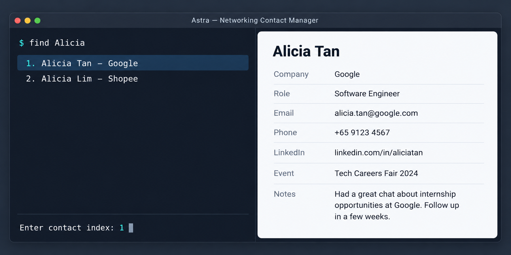

* **What it does:**
  * `/add` a contact, with multiple companies, roles, numbers and emails per person
  * `/find` a contact by name (partial matches allowed), phone number or email, and view everything stored about them
  * `/edit` details that were mistyped or have changed
  * `/delete` contacts by email, phone number or name, after confirmation
  * `/list` all contacts, `/help` for command formats, `/clear` the whole list, and `/exit`
  * Detects duplicate phone numbers and emails, and lets you keep, replace or merge the records
  * Saves automatically after every change, and recovers what it can from a corrupted data file

* This is **a sample project for Software Engineering (SE) students**. 
  Example usages:
  * as a starting point of a course project (as opposed to writing everything from scratch)
  * as a case study
* The project simulates an ongoing software project for a desktop application (called _AddressBook_) used for managing contact details.
  * It is **written in an object-oriented programming (OOP) style** and provides a **reasonably well-written** codebase of about 6 KLoC. It is **larger** than what students typically write in beginner-level software-engineering modules, without being overwhelming.
  * It comes with a **reasonable level of user and developer documentation**.
* It is named `AddressBook Level 3` (`AB3` for short) because it was initially created as a part of a series of `AddressBook` projects (`Level 1`, `Level 2`, `Level 3` ...).
* For the detailed documentation of this project, see the **[Address Book Product Website](https://se-education.org/addressbook-level3)**.
* This project is a **part of the se-education.org** initiative. If you would like to contribute code to this project, see [se-education.org](https://se-education.org/#contributing-to-se-edu) for more info.
