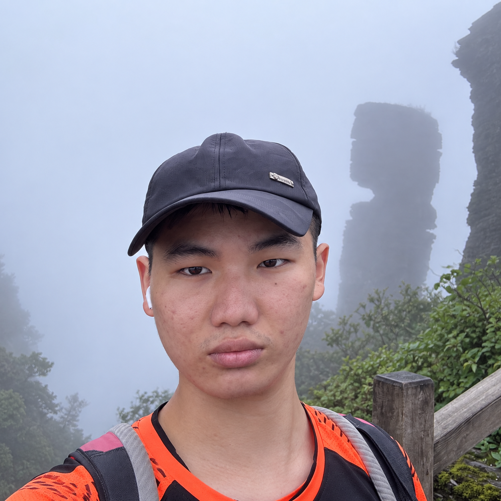
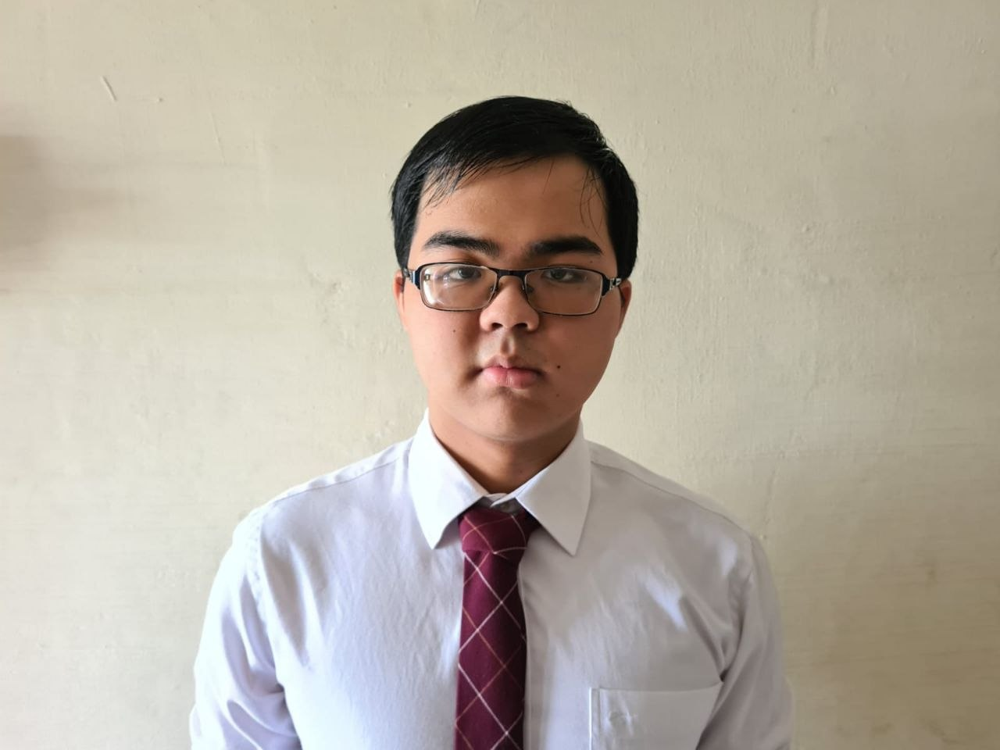

We are a team based in the [School of Computing, National University of Singapore](https://www.comp.nus.edu.sg).

You can reach us at the email `seer[at]comp.nus.edu.sg`

## Project team

### Ng Xuan Jin

[[github](https://github.com/ngxuanjin)]

* Role: Project Advisor

### Yuxiang Liu

[[github](https://github.com/Yx0905)]

### Jane Doe

[[github](http://github.com/johndoe)]
[[portfolio](team/johndoe.md)]

* Role: Team Lead
* Responsibilities: UI

### Yao Zhu

[[github](https://github.com/Cookiemunchrr)]

* Role: Developer
* Responsibilities: Logic

### Jean Doe

[[github](http://github.com/johndoe)]
[[portfolio](team/johndoe.md)]

* Role: Developer
* Responsibilities: Dev Ops + Threading

### Kee Yen Cheng

`[[github](http://github.com/keeyencheng)]

* Role: Developer
* Responsibilities: UI
